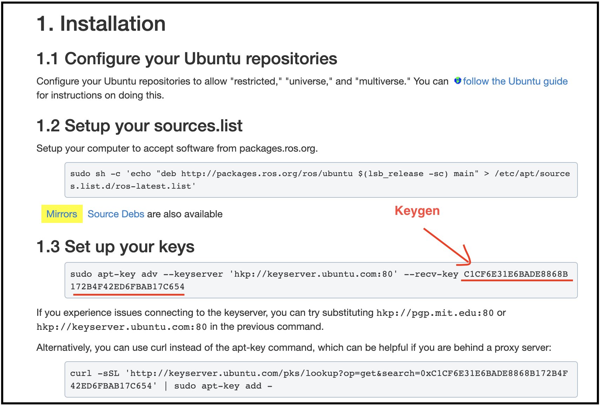

ROS
============

Prerequisites
-------------
- OS: Ubuntu 18.04

Install through Script
-----------------------
We provide a bash script to install ROS Melodic. Please clone the following git repository and run the command.

.. code-block:: bash

    git clone https://github.com/KaiChen1008/install-ROS
    cd install-ROS 
    chmod +x install-ROS
    ./install-ROS [ROS-keygen]

You can find the keygen in `ROS installation website <http://wiki.ros.org/melodic/Installation/Ubuntu>`_ .

..    :align: right

Install Manually
----------------
Setup your computer to accept software from packages.ros.org.

.. code-block:: bash

    sudo sh -c 'echo "deb http://packages.ros.org/ros/ubuntu $(lsb_release -sc) main" > /etc/apt/sources.list.d/ros-latest.list'

Find the keygen in `ROS installation website <http://wiki.ros.org/melodic/Installation/Ubuntu>`_ .

..    :align: right

Set up the ROS keygen.

.. code-block:: bash

    sudo apt-key adv --keyserver hkp://ha.pool.sks-keyservers.net:80 --recv-key [KEYGEN]

Install ROS Melodic.

.. code-block:: bash

    sudo apt-get install -y ros-melodic-desktop-full

Install dependencies.

.. code-block:: bash

    sudo apt-get install -y ros-melodic-desktop-full
    sudo apt-get install -y doxygen

    pip install catkin_pkg
    pip3 install catkin_pkg

Set up ROS
-----------
Initialize ROS.

.. code-block:: bash

    ssudo rosdep init
    rosdep update

Set up environment.

.. code-block:: bash

    echo "source /opt/ros/kinetic/setup.bash" >> ~/.bashrc
    source ~/.bashrc

Install dependencies.

.. code-block:: bash

    sudo apt install -y python-rosinstall python-rosinstall-generator python-wstool build-essential

Create a Workspace
------------------
Set up a catkin workspace.

.. code-block:: bash

    mkdir ~/catkin_ws
    cd ~/catkin_ws
    mkdir src
    catkin_make