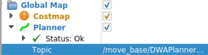

Planner Module
==============

Launch planner with Rviz
------------------------

Run launch file to launch planner and Rviz.

.. code-block:: bash

    roslaunch turtlebot3_navigation amcl_demo.launch

Change the global planner topic to ``/move_base/GlobalPlanner/plan``.

..    :align: right

Click the 2D Nav Goal button, 
then click on the desired destination on the map to generate a path. Beware that clicking on an obstacle is nonviable.

.. image:: ../images/nav2.png
   :scale: 70 %
   :alt: alternate text
..    :align: right

**NOTE** : Always run the localization module before running the planner module.

